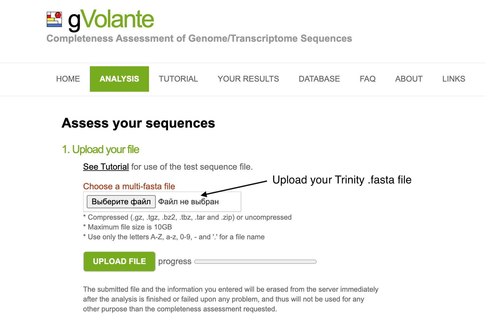
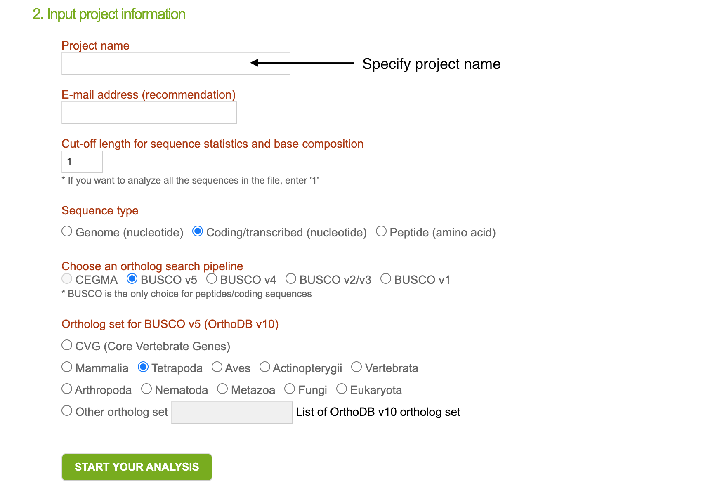

# De-Novo transcriptome assembly and annotation


During this lesson we will reconstruct transcriptome assembly for *Heilongjiang brown frog (Rana amurensis)* using RNA-seq data obtained from [https://www.nature.com/articles/s41598-022-24631-6#data-availability](https://www.nature.com/articles/s41598-022-24631-6#data-availability). We already downloaded pair-end raw .fastq files and prepared small toy datasets for you. Each pair of files (R1 and R2) constists of ~1700000 reads derived from heart, liver or muscle.

▶ First, choose your invidual dataset in a table here:
``` bash
https://docs.google.com/document/d/1aGLb3qV1N6Yxay0-QjzlTtZWk7JfUZYYd7drZeu7dtk/edit?usp=sharing
```

Once you decided upon dataset to work with, you can find your paired-end fastq files, named `<your_number>.R1.fq.gz` and `<your_number>.R2.fq.gz` in `/home/d.smirnov/homework5/data/`.❗Please do not copy them to your home directory, in all steps below you should simply specify the correct path to these files.

## Set up conda environment
▶ Activate `trinity` environment with all required tools pre-installed.

``` bash
/opt/anaconda3/bin/conda init 
conda activate trinity
```

## Read filtering

The first step is to remove adapters and low-quality reads from the raw .fastq files. To do this, run `TrimGalore` tool: 
``` bash
trim_galore --cores 2 --paired --gzip --fastqc --fastqc_args "-t 2" --output_dir data_filtered data/1.R1.fq.gz data/1.R2.fq.gz
```
where `--fastqc` argument means that we also want to perform quality assesement of filtered reads via `FastQC` using two computational cores (as specified by `--fastqc_args "-t 2"`).


## Run Trinity
This is the most crucial and time consuming step in the analysis. It might take several hours, therefore it make sence to launch Trinity in screen session. 

▶ Create your screen session:
``` bash
screen -r <session name>
```

▶ Run Trinity:
``` bash
Trinity --seqType fq --SS_lib_type RF --max_memory 2G --left data_filtered/<your_number>.R1_val_1.fq.gz --right data_filtered/<your_number>.R2_val_2.fq.gz --CPU 2
```
where `--SS_lib_type RF` means that the library preparation was done with a first strand protocol (we know that from the original paper). 

Once Trinity run is finished, `trinity_out_dir` folder will be created. Inside it you will find `Trinity.fasta` reconstructed assembly and temporary files and folders generated by program during all the stages of assembling. 

▶ Check the `Trinity.fasta` header:
``` bash
head Trinity.fasta
```

The output should have the following structure:
``` bash
>TRINITY_DN486518_c0_g1_i1 len=531 path=[0:0-530]
GGGGACGGCTATGCGGCCAGTGTATGAGGAGGAGGAAGGGGAGCAACAAGACGATCATCC
TGTGTTCAAGAACGGCGAACCTGATTACCAAGGCGAATACCTTTCGTGCTTTGAAGAGCC
CAACCTGCTGTACCGCATTTGCAACTCGGAAGACAAAACATGGGCGTTCTATAACGATAG
CCGCATCTACGAGATACATGTGCAGTTTAATTTCGGCAAGAACTCCAAGTTGCAGCCGCT
TGAAAACACCAGCATGTACACGAGGAACTCGGGTGAGCATGTTGCCAGAGTCATTGTATA
CCCTGGCGAAACGGAAATGTTTGTGCAGGGCACCGTTAACGGCTTCACAAGCAAGCTTCG
CGCGATCCCACTTTCTGAGGAGCACCACAAGTGCCGCCAGGCAATCACTTCCGCCATGAT
TGAGGAAGAGGCGAATCAGATTCGGCAGATTGTCGGGGACGCTGCAGACGCCGAGACCGC
ACTGAAGGCGTGCGTTGAGAACAACATTCCGTTCGTCGACCCCGAGTTCCC
```

## Obtain assembly statistics

Trinity has `TrinityStats.pl` script to compute basic assembly statistics, including N50 metrics, estimating the 'length of the shortest conting, for which longer and equal length contigs cover at least 50 % of the assembly' [1]

``` bash
TrinityStats.pl  Trinity.fasta
```
❓ How many trinity 'genes' and 'transcripts' did you get? (0.5 points)


## Transcript filtering
Now we want to filter out short redundant contigs that were erroneously assembled by Trinity. `CD-HIT` tool calculates transcript similarity values and merge transcripts based on similarity threshold of 90%.  
``` bash
cd-hit-est -o cdhit -c 0.98 -i trinity_out_dir/Trinity.fasta -p 1 -d 0 -b 3 -T 2 -M 1000
```
where `-p` is for printing an alignment overlap in .clstr file, `-b` represents band_width of alignment, `-T` is a number of threads and `-M` is a memory limit (in MB).

After filtering new filtered assembly will be stored in 'cdhit' file. Rename it to avoid confusion: 
``` bash
mv cdhit Trinity.filtered.fasta
```

Run QC script on filtered assembly again:
``` bash
TrinityStats.pl  Trinity.filtered.fasta
```

❓ How many trinity 'transcripts' were filtered out from the assembly? (0.5 points)

## Assembly completeness with gVolante
To assess completeness of the obtained assembly we will use `gVolante` web tool. Transfer filtered .fasta transcriptome to your local machine and then open https://gvolante.riken.jp/analysis.html. 

Upload your .fasta file, it may take few minutes:



▶ Select `Coding/transcribed (nucleotide)` sequence type and `BUSCO v5` as a pipeline to use. Select "Tetrapoda" as an ortholog set for `BUSCO v5`. Then click on 'Start your analysis'.



❓ Report BUSCO scores (*Complete and single-copy*, *Complete and duplicated*, *Fragmented*, or *Missing BUSCOs*) and a number of assembly transcripts that are > 1K in their length? (0.5 points)


## Transcript quantification

The next step is to quantify transcript abundance. Since we already have a reference transcriptome constructed by Trinity, we can align filtered RNA-seq reads on it and calculate transcript and gene expression levels. 

▶ Quantify expression for both transcrip and gene levels with Kallisto mode:
``` bash
align_and_estimate_abundance.pl --SS_lib_type RF --est_method kallisto --transcripts Trinity.filtered.fasta --seqType fq --left data_filtered/<your_number>.R1_val_1.fq.gz --right data_filtered/<your_number>.R2_val_2.fq.gz --output_dir kallisto_output --thread_count 2 --trinity_mode --prep_reference
```
Apart from *kallisto_output* folder this script will also generate two additional files: *Trinity.filtered.fasta.gene_trans_map*  and *Trinity.filtered.fasta.kallisto_idx*. Transcript and gene expression levels will be stored in *kallisto_output/abundance.tsv* and *kallisto_output/abundance.tsv.genes* tables, respectively.


``` bash
head kallisto_output/abundance.tsv

target_id       length  eff_length      est_counts      tpm
TRINITY_DN3897_c0_g1_i1 794     537.124 7       4.2194
TRINITY_DN3897_c1_g1_i1 581     324.353 8       7.98545
TRINITY_DN3809_c0_g1_i1 283     55.0072 2       11.7717
TRINITY_DN3844_c0_g1_i1 1149    892.124 24.4812 8.88454
TRINITY_DN3869_c0_g1_i1 417     162.011 2       3.9968
TRINITY_DN3869_c0_g2_i1 416     161.011 2       4.02162
TRINITY_DN3854_c0_g1_i1 487     230.719 1.67628 2.35229
TRINITY_DN3854_c0_g2_i1 490     233.719 3.32372 4.60423
TRINITY_DN3891_c0_g1_i1 472     215.852 3       4.49979
```

## Transcript annotation
While we already evaluated expression of each gene in the assembly, the biological interpretation of the obtained trinity features (represented like *TRINITY_DN3897_c0_g1*) is still a puzzle. To expand our understanding of what the assembled features are, we will perform several annotation procedures with *TransDecoder* and *Trinotate* tools.

▶ First, create Trinotate sqlite database by running the following line
``` bash
Build_Trinotate_Boilerplate_SQLite_db.pl  Trinotate
```
It will download *uniprot_sprot.pep* (protein sequence information from the SwissProt database) and *Pfam-A.hmm.gz* (protein domains) files.

To perform blast search with `uniprot_sprot.pep` searches, we should prepare a BLAST database:
``` bash
makeblastdb -in uniprot_sprot.pep -dbtype prot
```

▶ Prepare Pfam database
``` bash
gunzip Pfam-A.hmm.gz
hmmpress Pfam-A.hmm
```

▶ Run TransDecoder to identify the longest open reading frames (ORF) from the assembly file:
``` bash
TransDecoder.LongOrfs -m 10 -t Trinity.filtered.fasta
```

❗ The two annotation steps described below will be quite time consuming (several hours each), therefore consider using screen session.

▶ Blast against the SwissProt protein database:
``` bash
blastx -query Trinity.filtered.fasta -db uniprot_sprot.pep -num_threads 2 -max_target_seqs 1 -outfmt 6 > blastx.outfmt6
```

Query a set of the longest obtained ORFs against Swiss-Prot database to search for sequence similarity with known proteins
``` bash
blastp -query Trinity.filtered.fasta.transdecoder_dir/longest_orfs.pep -db uniprot_sprot.pep -num_threads 2 -max_target_seqs 1 -outfmt 6 > blastp.outfmt6
```

Once all three searches are done, we can start uploading information to `Trinotate.sqlite` database. First, load assembly .fasta file, longest_orfs.pep and gene_trans_map file (obtained with *align_and_estimate_abundance.pl* script during abundance quantificantion):
``` bash
Trinotate Trinotate.sqlite init --gene_trans_map Trinity.filtered.fasta.gene_trans_map \
                                --transcript_fasta Trinity.filtered.fasta \
                                --transdecoder_pep Trinity.filtered.fasta.transdecoder_dir/longest_orfs.pep
```

▶ Load blastp, blastx and pfam results
``` bash
Trinotate Trinotate.sqlite LOAD_swissprot_blastp blastp.outfmt6
Trinotate Trinotate.sqlite LOAD_swissprot_blastx blastx.outfmt6
```

▶ Finally, generate the report:
``` bash
Trinotate Trinotate.sqlite report > trinotate_annotation_report.xls
```

▶ Extract GO annotation terms from the report:
``` bash
extract_GO_assignments_from_Trinotate_xls.pl  \
        --Trinotate_xls trinotate_annotation_report.xls \
        -G --include_ancestral_terms > go_annotations.txt
```
▶ Explore the obtained *go_annotations.txt* files


## Integrating expression data and annotation

▶ Generate a map of trinity gene IDs and corresponding annotations
``` bash
Trinotate_get_feature_name_encoding_attributes.pl \
                  trinotate_annotation_report.xls  > annot_feature_map.txt
```

▶ Check *annot_feature_map.txt*:
``` bash
$ head annot_feature_map.txt

TRINITY_DN10000_c0_g1   TRINITY_DN10000_c0_g1^VKGC_RAT
TRINITY_DN10000_c0_g1_i1        TRINITY_DN10000_c0_g1_i1^VKGC_RAT
TRINITY_DN10000_c1_g1   TRINITY_DN10000_c1_g1^VKGC_DELLE
TRINITY_DN10000_c1_g1_i1        TRINITY_DN10000_c1_g1_i1^VKGC_DELLE
TRINITY_DN10001_c0_g2   TRINITY_DN10001_c0_g2^PAR10_HUMAN
TRINITY_DN10001_c0_g2_i1        TRINITY_DN10001_c0_g2_i1^PAR10_HUMAN
TRINITY_DN10006_c0_g1   TRINITY_DN10006_c0_g1^NDUBB_CRIGR
TRINITY_DN10006_c0_g1_i1        TRINITY_DN10006_c0_g1_i1^NDUBB_CRIGR
TRINITY_DN10006_c0_g1_i2        TRINITY_DN10006_c0_g1_i2^NDUBB_CRIGR
TRINITY_DN10007_c0_g1   TRINITY_DN10007_c0_g1^MRC1_HUMAN
```


▶ Update expession matrix with gene names:
``` bash
/home/d.smirnov/homework5/rename_matrix_feature_identifiers.pl salmon_output/abundance.tsv.genes \
                                        annot_feature_map.txt > Trinity_trans.counts.wAnnot.matrix
```
❓ How many genes were annotated? (1 point)

## Optional task 


``` bash
hmmscan --cpu 2 --domtblout TrinotatePFAM.out Pfam-A.hmm Trinity.filtered.fasta.transdecoder_dir/longest_orfs.pep > pfam.log
```

``` bash
Trinotate Trinotate.sqlite LOAD_pfam TrinotatePFAM.out
```


## References
[1] https://www.ncbi.nlm.nih.gov/pmc/articles/PMC5436433/#:~:text=N50%20is%20a%20metric%20widely,least%2050%20%25%20of%20the%20assembly.

[2] https://github.com/trinityrnaseq/trinityrnaseq/wiki

[3] https://github.com/Trinotate/Trinotate/wiki/Software-installation-and-data-required

## Assignment and grading

When you complete all the tasks please upload to Canvas:

* Report with answers and explanations.

* Your code (txt/pdf/markdown or something else readable)

How it will be graded:
* The maximum is 10 points.

* Optional task gives you 2 extra points

* For missing step - minus 5 points.

* If the report/code is missing - 0 points.

* For each missing figure/plot - minus 2 points.

* For each missing answer to ❓ - minus 2 points.

* For any other mistake - minus 0.2 point.

